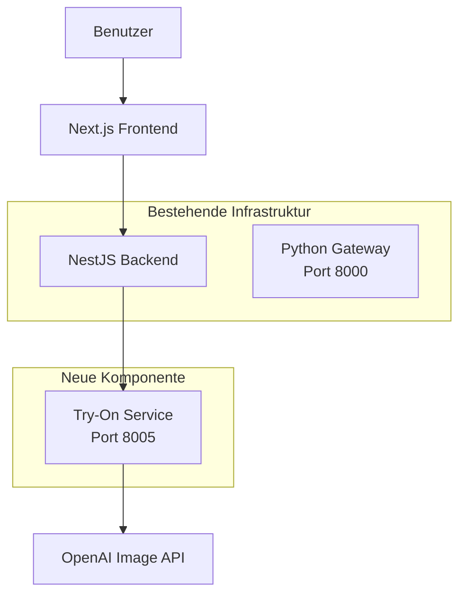

# Design Document: Virtual Try-On Feature

## Overview

Das Virtual Try-On Feature erweitert die bestehende "Find Your Own Style" Seite um die Möglichkeit, Kleidungsstücke auszuwählen und KI-generierte Visualisierungen zu erstellen. Die Implementierung folgt der bestehenden Microservice-Architektur und minimiert Änderungen am vorhandenen Code.

### Architektur-Prinzipien

1. **Maximale Code-Wiederverwendung**: Nutzen bestehender Komponenten (StyleItemCard, DashboardLayout, API-Patterns)
2. **Minimale Änderungen**: Nur notwendige Erweiterungen am bestehenden Code
3. **Konsistente Patterns**: Folgen der etablierten NestJS/FastAPI Architektur
4. **Isolierte Funktionalität**: Neuer Microservice ohne Abhängigkeiten zu bestehenden Services

### Technologie-Stack

- **Frontend**: Next.js 14, React, TypeScript, Shadcn/UI (bestehend)
- **Backend**: NestJS, TypeScript (bestehend)
- **Try-On Service**: Python 3.11, FastAPI, OpenAI SDK
- **Infrastruktur**: Docker, Docker Compose (bestehend)

## Architecture

### System-Komponenten



### Datenfluss

1. **Item-Auswahl**: Benutzer wählt Items im Frontend → State-Management in React
2. **Generate-Request**: Frontend → Backend `/api/try-on/generate` → Try-On Service
3. **Prompt-Konstruktion**: Try-On Service erstellt strukturierten Prompt aus Item-Daten
4. **Bildgenerierung**: Try-On Service → OpenAI API → Bild-URL zurück
5. **Anzeige**: Backend → Frontend → Modal mit generiertem Bild

## Components and Interfaces

### Frontend-Komponenten

#### 1. Erweiterte FindYourStylePage (Minimale Änderungen)

**Bestehende Datei**: `frontend/app/find-your-style/page.tsx`

**Neue State-Variablen**:

```typescript
// Auswahl-State für Try-On
const [selectedItems, setSelectedItems] = useState<Record<string, StyleItem>>(
  {},
);
// Kategorien: TOP, BOTTOM, SHOE, ACCESSORY

// Try-On State
const [isGenerating, setIsGenerating] = useState(false);
const [generatedImage, setGeneratedImage] = useState<string | null>(null);
const [showResultModal, setShowResultModal] = useState(false);
```

**Neue Funktionen**:

```typescript
// Item-Auswahl Toggle
const handleItemSelect = (item: StyleItem) => {
  setSelectedItems((prev) => {
    const category = item.category;
    if (prev[category]?._id === item._id) {
      // Abwählen
      const { [category]: _, ...rest } = prev;
      return rest;
    } else {
      // Auswählen (ersetzt vorheriges Item dieser Kategorie)
      return { ...prev, [category]: item };
    }
  });
};

// Try-On Generierung
const handleGenerate = async () => {
  setIsGenerating(true);
  try {
    const token = await getToken();
    const response = await generateTryOn(token, selectedItems);
    setGeneratedImage(response.imageUrl);
    setShowResultModal(true);
  } catch (error) {
    // Error handling
  } finally {
    setIsGenerating(false);
  }
};
```

**Änderungen am JSX**:

- Generate Button in Header hinzufügen (oben rechts)
- `onSelect` Prop an StyleItemCard übergeben
- `isSelected` Prop an StyleItemCard übergeben
- TryOnResultModal Komponente einbinden

#### 2. Erweiterte StyleItemCard (Minimale Änderungen)

**Bestehende Datei**: `frontend/components/style-item-card.tsx`

**Neue Props**:

```typescript
interface StyleItemCardProps {
  item: StyleItem;
  isSelected?: boolean; // NEU
  onSelect?: (item: StyleItem) => void; // NEU
}
```

**Änderungen**:

- Click-Handler für Auswahl hinzufügen (zusätzlich zum Link)
- Visuelles Feedback für ausgewählte Items (Border, Checkmark)
- Bestehende Link-Funktionalität bleibt erhalten

#### 3. Neue Komponente: GenerateButton

**Neue Datei**: `frontend/components/try-on/generate-button.tsx`

```typescript
interface GenerateButtonProps {
  selectedItems: Record<string, StyleItem>;
  isGenerating: boolean;
  onGenerate: () => void;
}
```

**Funktionalität**:

- Zeigt Anzahl ausgewählter Items
- Disabled wenn nicht TOP und BOTTOM ausgewählt
- Tooltip mit fehlenden Kategorien
- Loading-State während Generierung

#### 4. Neue Komponente: TryOnResultModal

**Neue Datei**: `frontend/components/try-on/try-on-result-modal.tsx`

```typescript
interface TryOnResultModalProps {
  isOpen: boolean;
  onClose: () => void;
  imageUrl: string;
  selectedItems: Record<string, StyleItem>;
}
```

**Funktionalität**:

- Zeigt generiertes Bild
- Zeigt ausgewählte Items als Thumbnails
- Download-Button für Bild
- Close-Button

### Backend-Komponenten

#### 1. Neuer Controller: TryOnController

**Neue Datei**: `backend/src/try-on/try-on.controller.ts`

```typescript
@ApiTags("try-on")
@Controller("try-on")
@UseGuards(ClerkAuthGuard)
@ApiBearerAuth()
export class TryOnController {
  constructor(private readonly tryOnService: TryOnService) {}

  @Post("generate")
  @HttpCode(HttpStatus.OK)
  @ApiOperation({ summary: "Generate virtual try-on image" })
  async generate(
    @Body() dto: GenerateTryOnDto,
    @Request() req,
  ): Promise<GenerateTryOnResponse> {
    return this.tryOnService.generate(dto, req.user.userId);
  }
}
```

#### 2. Neuer Service: TryOnService

**Neue Datei**: `backend/src/try-on/try-on.service.ts`

```typescript
@Injectable()
export class TryOnService {
  constructor(
    private readonly httpService: HttpService,
    private readonly configService: ConfigService,
  ) {}

  async generate(
    dto: GenerateTryOnDto,
    userId: string,
  ): Promise<GenerateTryOnResponse> {
    // Validierung
    this.validateRequest(dto);

    // Aufruf des Try-On Service
    const pythonEngineUrl = this.configService.get("PYTHON_ENGINE_URL");
    const response = await this.httpService
      .post(`${pythonEngineUrl}/api/v1/try-on/generate`, {
        items: dto.items,
        userId: userId,
      })
      .toPromise();

    return {
      success: true,
      imageUrl: response.data.image_url,
      metadata: response.data.metadata,
    };
  }

  private validateRequest(dto: GenerateTryOnDto): void {
    // Mindestens ein Item erforderlich
    const categories = Object.keys(dto.items);
    if (categories.length === 0) {
      throw new BadRequestException("At least one item is required");
    }
  }
}
```

#### 3. DTOs

**Neue Datei**: `backend/src/try-on/dto/generate-try-on.dto.ts`

```typescript
export class GenerateTryOnDto {
  @ApiProperty()
  items: Record<
    string,
    {
      id: string;
      name: string;
      description?: string;
      imageUrl: string;
      color?: string;
      category: string;
    }
  >;
}

export class GenerateTryOnResponse {
  success: boolean;
  imageUrl?: string;
  metadata?: any;
  error?: string;
}
```

### Try-On Microservice (Python)

#### Verzeichnisstruktur

```
python_engine/
└── try_on_service/
    ├── Dockerfile
    ├── requirements.txt
    ├── app/
    │   ├── __init__.py
    │   ├── main.py
    │   ├── core/
    │   │   ├── __init__.py
    │   │   ├── config.py
    │   │   └── logger.py
    │   ├── api/
    │   │   ├── __init__.py
    │   │   └── v1/
    │   │       ├── __init__.py
    │   │       ├── router.py
    │   │       └── endpoints/
    │   │           ├── __init__.py
    │   │           └── try_on.py
    │   └── services/
    │       ├── __init__.py
    │       ├── prompt_builder.py
    │       └── openai_service.py
```

#### 1. Main Application

**Datei**: `python_engine/try_on_service/app/main.py`

```python
from fastapi import FastAPI
from fastapi.middleware.cors import CORSMiddleware
from app.core.config import get_settings
from app.core.logger import get_logger
from app.api.v1.router import api_router

settings = get_settings()
logger = get_logger(__name__)

app = FastAPI(
    title="Try-On Service",
    version="1.0.0",
    description="Virtual try-on image generation service",
    docs_url="/docs"
)

# CORS Middleware (wie bei anderen Services)
app.add_middleware(
    CORSMiddleware,
    allow_origins=settings.ALLOWED_ORIGINS,
    allow_credentials=False,
    allow_methods=["*"],
    allow_headers=["*"],
)

# API Router
app.include_router(api_router, prefix=settings.API_V1_PREFIX)

@app.get("/")
async def root():
    return {"service": "Try-On Service", "version": "1.0.0"}

@app.get("/health")
async def health():
    return {"status": "healthy"}
```

#### 2. Configuration

**Datei**: `python_engine/try_on_service/app/core/config.py`

```python
from pydantic_settings import BaseSettings
from functools import lru_cache

class Settings(BaseSettings):
    APP_NAME: str = "Try-On Service"
    APP_VERSION: str = "1.0.0"
    API_V1_PREFIX: str = "/api/v1"
    ALLOWED_ORIGINS: list = ["http://localhost:3000"]

    # OpenAI Configuration
    OPENAI_API_KEY: str

    class Config:
        env_file = ".env"

@lru_cache()
def get_settings() -> Settings:
    return Settings()
```

#### 3. OpenAI Service

**Datei**: `python_engine/try_on_service/app/services/openai_service.py`

```python
from openai import OpenAI
from app.core.config import get_settings
from app.core.logger import get_logger

logger = get_logger(__name__)
settings = get_settings()

class OpenAIService:
    def __init__(self):
        self.client = OpenAI(api_key=settings.OPENAI_API_KEY)

    async def edit_image(self, user_photo_url: str, clothing_image_urls: list[str], prompt: str) -> dict:
        """
        Bearbeitet ein Benutzerfoto mit der OpenAI Image Edit API.

        Die API erwartet ein Array von Bildern:
        - Erstes Bild: Das Benutzerfoto
        - Weitere Bilder: Die Kleidungsstücke

        Args:
            user_photo_url: URL zum Benutzerfoto
            clothing_image_urls: Liste von URLs zu Kleidungsstück-Bildern
            prompt: Der strukturierte Prompt für die Bildbearbeitung

        Returns:
            dict mit image_base64
        """
        try:
            logger.info(f"Editing image with {len(clothing_image_urls)} clothing items")
            logger.info(f"Prompt: {prompt[:100]}...")

            import requests
            import tempfile
            import os
            import shutil

            # Create temp directory for downloaded images
            temp_dir = tempfile.mkdtemp()

            try:
                # Download user photo
                user_photo_response = requests.get(user_photo_url)
                user_photo_response.raise_for_status()
                user_photo_path = os.path.join(temp_dir, "user_photo.jpg")
                with open(user_photo_path, 'wb') as f:
                    f.write(user_photo_response.content)

                # Download clothing images
                clothing_paths = []
                for idx, clothing_url in enumerate(clothing_image_urls):
                    clothing_response = requests.get(clothing_url)
                    clothing_response.raise_for_status()
                    clothing_path = os.path.join(temp_dir, f"clothing_{idx}.jpg")
                    with open(clothing_path, 'wb') as f:
                        f.write(clothing_response.content)
                    clothing_paths.append(clothing_path)

                # Prepare image files array: [user_photo, clothing1, clothing2, ...]
                image_files = []
                with open(user_photo_path, 'rb') as f:
                    image_files.append(("user_photo.jpg", f.read(), "image/jpeg"))

                for clothing_path in clothing_paths:
                    with open(clothing_path, 'rb') as f:
                        image_files.append((os.path.basename(clothing_path), f.read(), "image/jpeg"))

                logger.info(f"Calling OpenAI images.edit with {len(image_files)} images")

                # Call OpenAI Image Edit API with array of images
                response = self.client.images.edit(
                    model="gpt-image-1",
                    image=image_files,
                    prompt=prompt,
                    input_fidelity="high",
                    quality="low",
                    response_format="b64_json"
                )

                # Get base64 image data
                image_base64 = response.data[0].b64_json

                if not image_base64:
                    raise Exception("No image data in OpenAI response")

                logger.info(f"Image edited successfully")

                return {
                    "image_base64": image_base64
                }

            finally:
                # Clean up temp files
                shutil.rmtree(temp_dir, ignore_errors=True)

        except Exception as e:
            logger.error(f"OpenAI API error: {str(e)}")
            raise
```

#### 4. Prompt Builder Service

**Datei**: `python_engine/try_on_service/app/services/prompt_builder.py`

```python
from typing import Dict, Any
from app.core.logger import get_logger

logger = get_logger(__name__)

class PromptBuilder:
    """
    Konstruiert strukturierte Prompts für die OpenAI Image Edit API.
    Basiert auf Best Practices für fotorealistische Virtual Try-On Ergebnisse.
    """

    def build_try_on_prompt(self, items: Dict[str, Any]) -> str:
        """
        Erstellt einen detaillierten Prompt basierend auf ausgewählten Items.

        Der Prompt folgt dem Pattern aus dem erfolgreichen Beispiel:
        - Klare Anweisungen für fotorealistische Ergebnisse
        - Betonung auf natürliche Passform und Beleuchtung
        - Erhaltung der Person-Identität

        Args:
            items: Dictionary mit Kategorien als Keys und Item-Daten als Values

        Returns:
            Strukturierter Prompt-String
        """
        item_count = len(items)
        item_type = "clothing item" if item_count == 1 else "clothing items"

        # Build item descriptions
        item_descriptions = []
        category_order = ['TOP', 'BOTTOM', 'SHOE', 'ACCESSORY']

        for category in category_order:
            if category in items:
                item = items[category]
                desc = self._format_item_description(item, category)
                if desc:
                    item_descriptions.append(desc)

        items_text = ", ".join(item_descriptions) if item_descriptions else "the provided clothing"

        # Build prompt based on item count
        if item_count == 1:
            prompt = f"""Create a photorealistic virtual try-on by seamlessly having the person in the first image wear {items_text} from the second image.

Instructions:
- Replace or add ONLY the specific clothing piece, keeping everything else identical
- Maintain the person's exact face, skin tone, body proportions, and pose
- Ensure the new clothing fits naturally on their body with realistic shadows, wrinkles, and fabric draping
- Match the lighting and color temperature of the original photo
- Preserve the background and overall composition
- Make the clothing appear as if it was originally worn in the photo
- The final image should be indistinguishable from a real photograph of the person wearing this item."""
        else:
            prompt = f"""Create a photorealistic virtual try-on by seamlessly dressing the person in the first image with {items_text}.

Instructions:
- Replace ONLY the clothing with the new {item_type}, keeping everything else identical
- Maintain the person's exact face, skin tone, body proportions, and pose
- Ensure the new clothing fits naturally on their body with realistic shadows, wrinkles, and fabric draping
- Match the lighting and color temperature of the original photo
- Preserve the background and overall composition
- Make the clothing appear as if it was originally worn in the photo
- For multiple items: coordinate them as a cohesive outfit
- Result should look like a professional fashion photograph, not a digital overlay
The final image should be indistinguishable from a real photograph of the person wearing these {item_type}."""

        logger.info(f"Built prompt for {item_count} items")
        return prompt

    def _format_item_description(self, item: Dict[str, Any], category: str) -> str:
        """
        Formatiert die Beschreibung eines einzelnen Items für den Prompt.
        """
        parts = []

        # Farbe
        if item.get('color'):
            parts.append(item['color'])

        # Name/Beschreibung
        if item.get('description'):
            parts.append(item['description'])
        elif item.get('name'):
            parts.append(item['name'])
        elif item.get('name'):
            parts.append(item['name'])

        # Material (falls vorhanden)
        if item.get('material'):
            parts.append(f"made of {item['material']}")

        return " ".join(parts) + ","
```

#### 5. Try-On Endpoint

**Datei**: `python_engine/try_on_service/app/api/v1/endpoints/try_on.py`

```python
from fastapi import APIRouter, HTTPException, status
from pydantic import BaseModel
from typing import Dict, Any
from app.services.openai_service import OpenAIService
from app.services.prompt_builder import PromptBuilder
from app.core.logger import get_logger

router = APIRouter()
logger = get_logger(__name__)

# Singleton-Instanzen
openai_service = OpenAIService()
prompt_builder = PromptBuilder()

class TryOnRequest(BaseModel):
    userPhotoUrl: str
    items: Dict[str, Dict[str, Any]]
    userId: str

class TryOnResponse(BaseModel):
    image_base64: str
    metadata: Dict[str, Any]

@router.post("/generate", response_model=TryOnResponse)
async def generate_try_on(request: TryOnRequest):
    """
    Generiert ein Virtual Try-On Bild basierend auf ausgewählten Items.

    Die Methode:
    1. Validiert die Eingabe (userPhotoUrl + mindestens 1 Item)
    2. Erstellt einen detaillierten Prompt
    3. Extrahiert Kleidungsstück-Bild-URLs
    4. Ruft OpenAI Image Edit API mit Benutzerfoto + Kleidungsstück-Bildern auf
    5. Gibt Base64-Bild zurück
    """
    try:
        logger.info(f"Try-on request from user {request.userId}")

        # Validierung
        if not request.userPhotoUrl:
            raise HTTPException(
                status_code=status.HTTP_400_BAD_REQUEST,
                detail="User photo URL is required"
            )

        if len(request.items) == 0:
            raise HTTPException(
                status_code=status.HTTP_400_BAD_REQUEST,
                detail="At least one item is required"
            )

        # Prompt erstellen
        prompt = prompt_builder.build_try_on_prompt(request.items)

        # Kleidungsstück-Bild-URLs extrahieren
        clothing_image_urls = []
        for category, item in request.items.items():
            if 'imageUrl' in item:
                clothing_image_urls.append(item['imageUrl'])

        # Bild bearbeiten mit OpenAI Image Edit API
        result = await openai_service.edit_image(
            user_photo_url=request.userPhotoUrl,
            clothing_image_urls=clothing_image_urls,
            prompt=prompt
        )

        # Response zusammenstellen
        return TryOnResponse(
            image_base64=result["image_base64"],
            metadata={
                "user_id": request.userId,
                "items_count": len(request.items),
                "categories": list(request.items.keys())
            }
        )

    except HTTPException:
        raise
    except Exception as e:
        logger.error(f"Error generating try-on: {str(e)}")
        raise HTTPException(
            status_code=status.HTTP_500_INTERNAL_SERVER_ERROR,
            detail=f"Failed to generate try-on image: {str(e)}"
        )
```

#### 6. Dockerfile

**Datei**: `python_engine/try_on_service/Dockerfile`

```dockerfile
FROM python:3.11-slim

WORKDIR /app

# System dependencies
RUN apt-get update && apt-get install -y --no-install-recommends \
    curl \
    && rm -rf /var/lib/apt/lists/*

# Python dependencies
COPY requirements.txt .
RUN pip install --no-cache-dir -r requirements.txt

# Application code
COPY app/ ./app/

# Expose port
EXPOSE 8005

# Health check
HEALTHCHECK --interval=30s --timeout=10s --start-period=10s --retries=3 \
    CMD curl -f http://localhost:8005/health || exit 1

# Run application
CMD ["uvicorn", "app.main:app", "--host", "0.0.0.0", "--port", "8005"]
```

#### 7. Requirements

**Datei**: `python_engine/try_on_service/requirements.txt`

```
fastapi==0.109.0
uvicorn[standard]==0.27.0
pydantic==2.5.3
pydantic-settings==2.1.0
openai==1.10.0
python-dotenv==1.0.0
```

### Frontend API Client

**Neue Datei**: `frontend/lib/try-on-api.ts`

```typescript
export interface TryOnItem {
  id: string;
  name: string;
  description?: string;
  imageUrl: string;
  color?: string;
  category: string;
  material?: string;
}

export interface GenerateTryOnRequest {
  items: Record<string, TryOnItem>;
}

export interface GenerateTryOnResponse {
  success: boolean;
  imageUrl?: string;
  metadata?: any;
  error?: string;
}

export async function generateTryOn(
  token: string,
  items: Record<string, StyleItem>,
): Promise<GenerateTryOnResponse> {
  const apiUrl = process.env.NEXT_PUBLIC_API_URL || "http://localhost:3001";

  // Items in das richtige Format konvertieren
  const formattedItems: Record<string, TryOnItem> = {};
  for (const [category, item] of Object.entries(items)) {
    formattedItems[category] = {
      id: item._id,
      name: item.name,
      description: item.description,
      imageUrl: item.imageUrls?.[0] || item.primaryImageUrl,
      color: item.color,
      category: item.category,
      material: item.material,
    };
  }

  const response = await fetch(`${apiUrl}/try-on/generate`, {
    method: "POST",
    headers: {
      "Content-Type": "application/json",
      Authorization: `Bearer ${token}`,
    },
    body: JSON.stringify({ items: formattedItems }),
  });

  if (!response.ok) {
    const error = await response.json();
    throw new Error(error.message || "Failed to generate try-on image");
  }

  return response.json();
}
```

## Data Models

### Frontend State

```typescript
// Selection State
interface SelectionState {
  TOP?: StyleItem;
  BOTTOM?: StyleItem;
  SHOE?: StyleItem;
  ACCESSORY?: StyleItem;
}

// Try-On State
interface TryOnState {
  isGenerating: boolean;
  generatedImage: string | null;
  error: string | null;
  showResultModal: boolean;
}
```

### Backend DTOs

```typescript
// Request DTO
class GenerateTryOnDto {
  items: Record<
    string,
    {
      id: string;
      name: string;
      description?: string;
      imageUrl: string;
      color?: string;
      category: string;
      material?: string;
    }
  >;
}

// Response DTO
class GenerateTryOnResponse {
  success: boolean;
  imageUrl?: string;
  metadata?: {
    user_id: string;
    items_count: number;
    categories: string[];
    revised_prompt?: string;
  };
  error?: string;
}
```

### Python Models

```python
# Request Model
class TryOnRequest(BaseModel):
    items: Dict[str, Dict[str, Any]]
    userId: str

# Response Model
class TryOnResponse(BaseModel):
    image_url: str
    revised_prompt: str
    metadata: Dict[str, Any]
```

## Correctness Properties

Eine Property ist eine Eigenschaft oder ein Verhalten, das über alle gültigen Ausführungen eines Systems hinweg wahr sein sollte - im Wesentlichen eine formale Aussage darüber, was das System tun soll. Properties dienen als Brücke zwischen menschenlesbaren Spezifikationen und maschinell verifizierbaren Korrektheitsgarantien.

### Frontend Properties

**Property 1: Item Selection Toggle**
_For any_ Style_Item, clicking it once should add it to the selection state, and clicking it again should remove it from the selection state (idempotent toggle behavior).
**Validates: Requirements 1.1, 1.2**

**Property 2: Single Item Per Category Invariant**
_For any_ selection state and any category, there should be at most one selected item per category at any time.
**Validates: Requirements 1.3, 1.4**

**Property 3: Generate Button State Consistency**
_For any_ selection state, the Generate Button should be enabled if and only if at least one item is selected.
**Validates: Requirements 2.2, 2.3**

**Property 4: API Request Payload Completeness**
_For any_ valid selection state with at least one item, clicking Generate should trigger an API request containing all selected items with their complete metadata (id, name, description, imageUrl, color, category, material).
**Validates: Requirements 3.1, 3.4**

**Property 5: Loading State During Generation**
_For any_ try-on generation request, while the request is in progress, the loading indicator should be visible and the Generate Button should be disabled.
**Validates: Requirements 3.2, 3.3**

**Property 6: Error Recovery**
_For any_ API error during generation, the frontend should display an error message and reset the generating state to allow retry.
**Validates: Requirements 3.5**

**Property 7: Modal State Preservation**
_For any_ successful image generation, closing the result modal should preserve the selection state unchanged.
**Validates: Requirements 7.5**

### Backend Properties

**Property 8: Authentication Enforcement**
_For any_ request to `/api/try-on/generate` without a valid authentication token, the backend should return a 401 Unauthorized status.
**Validates: Requirements 4.2**

**Property 9: Request Validation**
_For any_ request to `/api/try-on/generate` that does not include at least one item, the backend should return a 400 Bad Request status with a descriptive error message.
**Validates: Requirements 4.3**

**Property 10: Service Integration**
_For any_ valid and authenticated request, the backend should forward the request to the Try_On_Service and return the service's response to the client.
**Validates: Requirements 4.4**

**Property 11: Error Propagation**
_For any_ error response from the Try_On_Service, the backend should return an appropriate HTTP status code (4xx for client errors, 5xx for server errors) with a descriptive error message.
**Validates: Requirements 4.6**

**Property 12: Response Format Consistency**
_For any_ successful generation, the backend response should contain an object with `success: true`, `imageUrl`, and `metadata` fields.
**Validates: Requirements 10.1**

**Property 13: Error Response Format**
_For any_ failed generation, the backend response should contain an object with `success: false`, `error`, and `message` fields.
**Validates: Requirements 10.2**

**Property 14: HTTP Status Code Correctness**
_For any_ request, the backend should return 200 for success, 400 for client errors (validation failures), 401 for authentication failures, and 500 for server errors.
**Validates: Requirements 10.5**

### Try-On Service Properties

**Property 15: Prompt Construction Completeness**
_For any_ valid request with selected items, the generated prompt should include: (1) a fashion photography scene description, (2) descriptions of all selected items including their colors and categories, (3) professional lighting and style instructions.
**Validates: Requirements 6.1, 6.2, 6.3, 6.5**

**Property 16: OpenAI API Integration**
_For any_ valid prompt, the Try_On_Service should call the OpenAI Image Generation API and return the image URL from the response.
**Validates: Requirements 5.6, 5.7**

**Property 17: Error Handling**
_For any_ error from the OpenAI API (rate limit, content policy, network error), the Try_On_Service should catch the error and return a structured error response with appropriate error details.
**Validates: Requirements 5.8, 8.1, 8.2, 8.3**

**Property 18: Service Response Format**
_For any_ successful generation, the Try_On_Service response should contain `image_url`, `revised_prompt`, and `metadata` fields.
**Validates: Requirements 10.3**

**Property 19: Service Error Response Format**
_For any_ failed generation, the Try_On_Service response should contain `error` and `details` fields.
**Validates: Requirements 10.4**

## Error Handling

### Frontend Error Handling

1. **API Request Failures**
   - Network errors: Display "Connection failed" message
   - Timeout (>30s): Display "Generation is taking longer than expected" message
   - Server errors: Display generic error message with retry option

2. **Validation Errors**
   - Missing required items: Disable Generate button, show tooltip
   - Invalid item data: Log error, prevent submission

3. **State Management Errors**
   - Selection state corruption: Reset to empty state
   - Modal state issues: Force close and reset

### Backend Error Handling

1. **Authentication Errors**
   - Missing token: Return 401 with "Authentication required"
   - Invalid token: Return 401 with "Invalid authentication token"

2. **Validation Errors**
   - Missing items: Return 400 with "At least one item is required"
   - Invalid item format: Return 400 with specific field error

3. **Service Communication Errors**
   - Try-On Service unavailable: Return 503 with "Service temporarily unavailable"
   - Try-On Service timeout: Return 504 with "Request timeout"
   - Try-On Service error: Return 500 with error details

### Try-On Service Error Handling

1. **OpenAI API Errors**
   - Rate limit (429): Return structured error with "Rate limit exceeded, please try again later"
   - Content policy violation (400): Return "Content policy violation, cannot generate this combination"
   - Authentication error (401): Log critical error, return "Service configuration error"
   - Network error: Return "Failed to connect to image generation service"

2. **Request Validation Errors**
   - Missing required fields: Return 400 with field-specific error
   - Invalid item format: Return 400 with validation details

3. **Internal Errors**
   - Prompt building failure: Log error, return 500 with "Failed to process request"
   - Unexpected exceptions: Log full stack trace, return 500 with generic message

### Error Logging Strategy

- **Frontend**: Console errors for development, error tracking service for production
- **Backend**: Structured logging with request IDs, user IDs, and error context
- **Try-On Service**: Detailed logging including prompts (sanitized), API responses, and timing

## Testing Strategy

### Dual Testing Approach

Das Feature wird mit einer Kombination aus Unit Tests und Property-Based Tests getestet:

- **Unit Tests**: Spezifische Beispiele, Edge Cases, Error Conditions
- **Property Tests**: Universelle Properties über alle Inputs hinweg
- Beide Ansätze sind komplementär und notwendig für umfassende Abdeckung

### Frontend Testing

**Unit Tests**:

- Component rendering tests (StyleItemCard, GenerateButton, TryOnResultModal)
- User interaction tests (click handlers, modal open/close)
- API client tests (mocked responses)
- Error state rendering tests

**Property Tests** (mit fast-check):

- Property 1: Item selection toggle behavior
- Property 2: Single item per category invariant
- Property 3: Generate button state consistency
- Property 4: API request payload completeness
- Property 5: Loading state during generation
- Property 6: Error recovery behavior
- Property 7: Modal state preservation

**Configuration**: Minimum 100 iterations per property test

### Backend Testing

**Unit Tests**:

- Controller endpoint tests
- Service method tests with mocked dependencies
- DTO validation tests
- Authentication guard tests

**Property Tests** (mit fast-check):

- Property 8: Authentication enforcement
- Property 9: Request validation
- Property 10: Service integration
- Property 11: Error propagation
- Property 12: Response format consistency
- Property 13: Error response format
- Property 14: HTTP status code correctness

**Integration Tests**:

- End-to-end flow with mocked Try-On Service
- Error scenarios with various service responses

**Configuration**: Minimum 100 iterations per property test

### Try-On Service Testing

**Unit Tests**:

- Prompt builder tests with various item combinations
- OpenAI service tests with mocked API
- Error handling tests for specific API errors
- Configuration loading tests

**Property Tests** (mit Hypothesis):

- Property 15: Prompt construction completeness
- Property 16: OpenAI API integration
- Property 17: Error handling
- Property 18: Service response format
- Property 19: Service error response format

**Integration Tests**:

- Real OpenAI API calls (limited, in staging only)
- Docker container health checks
- Service-to-service communication

**Configuration**: Minimum 100 iterations per property test

### Property Test Tagging

Jeder Property Test muss mit einem Kommentar versehen werden, der auf die Design-Property verweist:

```typescript
// Feature: virtual-try-on, Property 1: Item Selection Toggle
test("item selection toggle behavior", () => {
  fc.assert(
    fc.property(
      fc.record({
        /* item generator */
      }),
      (item) => {
        // Test implementation
      },
    ),
    { numRuns: 100 },
  );
});
```

```python
# Feature: virtual-try-on, Property 15: Prompt Construction Completeness
@given(st.dictionaries(st.text(), st.dictionaries(st.text(), st.text())))
@settings(max_examples=100)
def test_prompt_construction_completeness(items):
    # Test implementation
    pass
```

### Testing Libraries

- **Frontend**: Jest, React Testing Library, fast-check (property-based testing)
- **Backend**: Jest, Supertest, fast-check (property-based testing)
- **Try-On Service**: pytest, Hypothesis (property-based testing), pytest-asyncio

### Test Coverage Goals

- **Unit Test Coverage**: Minimum 80% line coverage
- **Property Test Coverage**: All 19 correctness properties implemented
- **Integration Test Coverage**: All critical user flows covered
