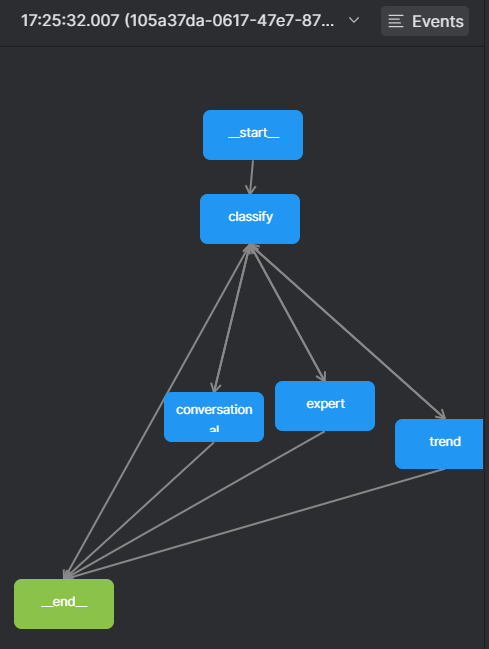

# Python Engine (Chat) — Development README

This folder contains a lightweight conversational engine built with a simple intent classification → agent routing → loop. You can run it locally without any API service. API endpoints are not yet implemented and are under active development.

## What’s here
- `app/graph.py`: the LangGraph-style flow builder (classify → agent → loop/end)
- `app/main.py`: interactive CLI runner (no API yet)
- `app/state.py`: shared state shape used by nodes
- `agents/`: simple agent nodes (classifier, conversational, trend, expert)
- `routing/router.py`: intent routing after classification
- `tools/`: helper utilities (e.g., trend, user analysis)
- `docs/`: diagrams and samples
  - `graph.png`: sample flow diagram
  - `event1_sample.png`, `event2_sample.png`: extra visuals
  - `sample_conv.txt`: a short example conversation transcript

## Quick start (Windows PowerShell)

```powershell
# From the repository root (create a venv)
python -m venv .venv
.\.venv\Scripts\Activate.ps1

# Install dependencies for the python engine
pip install --upgrade pip
pip install -r backend\src\chat\python_engine\requirements.txt

# Start the interactive chat engine (no API service yet)
python backend\src\chat\python_engine\app\main.py
```

## Environment Variables

Create a `.env` file in the project root and add your API key:

```env
GEMINI_API_KEY="AIzaSy...YOUR_REAL_API_KEY_HERE"
```

## Current status
- API services are NOT implemented yet. This is a test/development runner you can use to validate the loop and agent routing.
- The loop behavior:
  - classify → route to a specific agent → agent replies
  - agent decides whether to continue or end (via flags like `should_continue` or `should_end`)
  - if `should_continue` is true, the flow goes back to classify; otherwise it ends after one response

## Sample graph

The following diagram is available in `docs/graph.png`. It represents the classify → agent → loop/end flow.



## Sample conversation

A short transcript is available in `docs/sample_conv.txt`. Here is a shortened example flow:

```
USER: Hi, can you tell me about this season's trends?
AGENT[trend]: Key trends for Fall/Winter 2025 include oversized tailoring, earthy neutrals, quiet luxury, leather details, and monochrome outfits. Would you like a tailored outfit suggestion?

USER: Yes, recommend something for a business meeting next week.
AGENT[expert]: Consider a tailored charcoal suit with a soft-cashmere turtleneck in warm beige, leather belt and minimalist black boots. It balances quiet luxury with a professional tone.

USER: Thanks!
AGENT[conversational]: Happy to help. Have a great meeting!
```

For the full example, open `docs/sample_conv.txt`.
