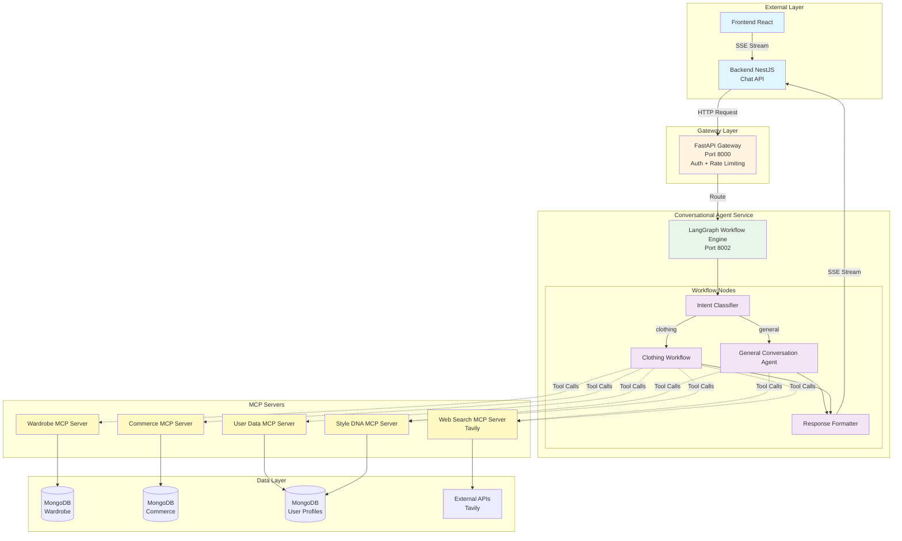
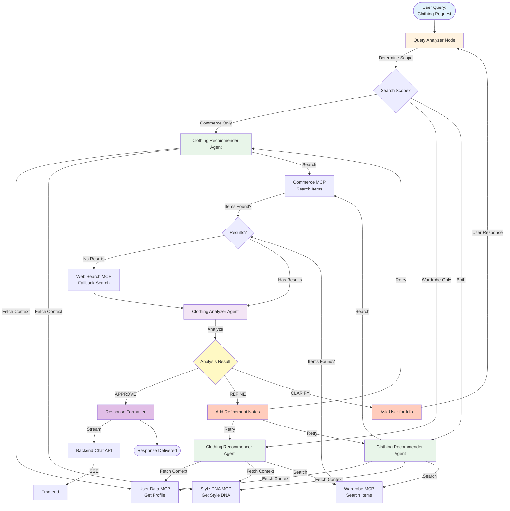
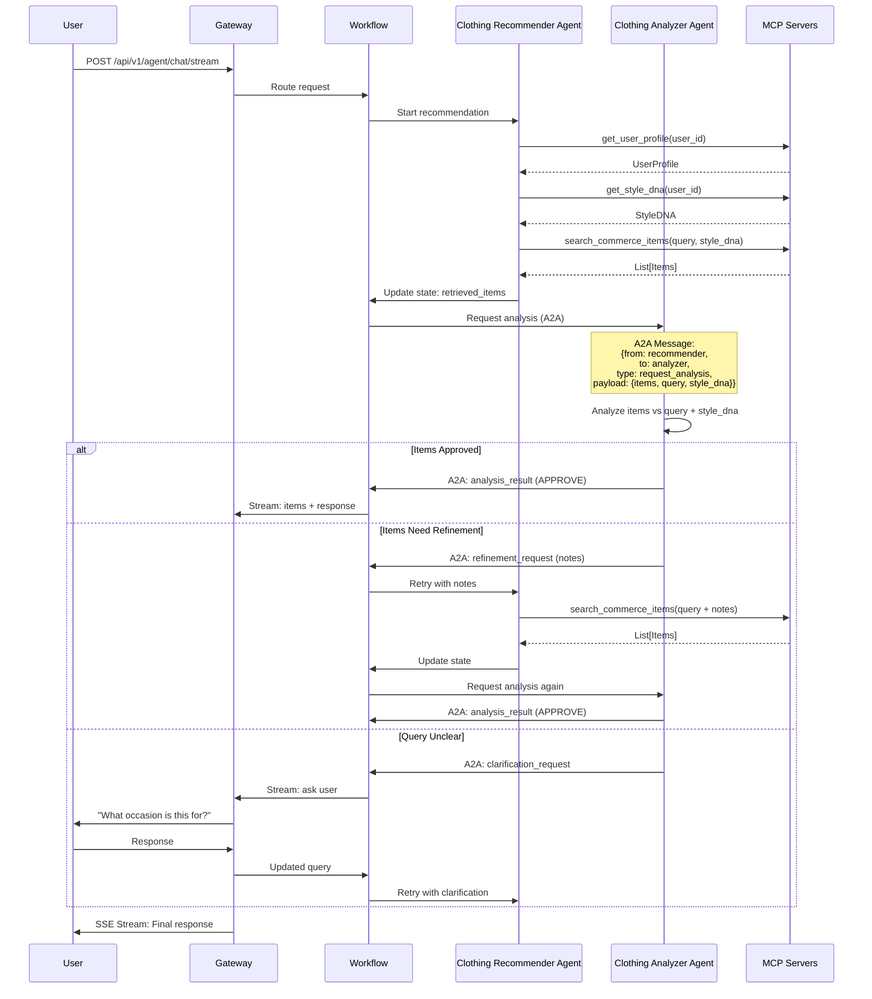
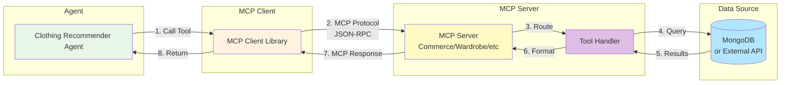
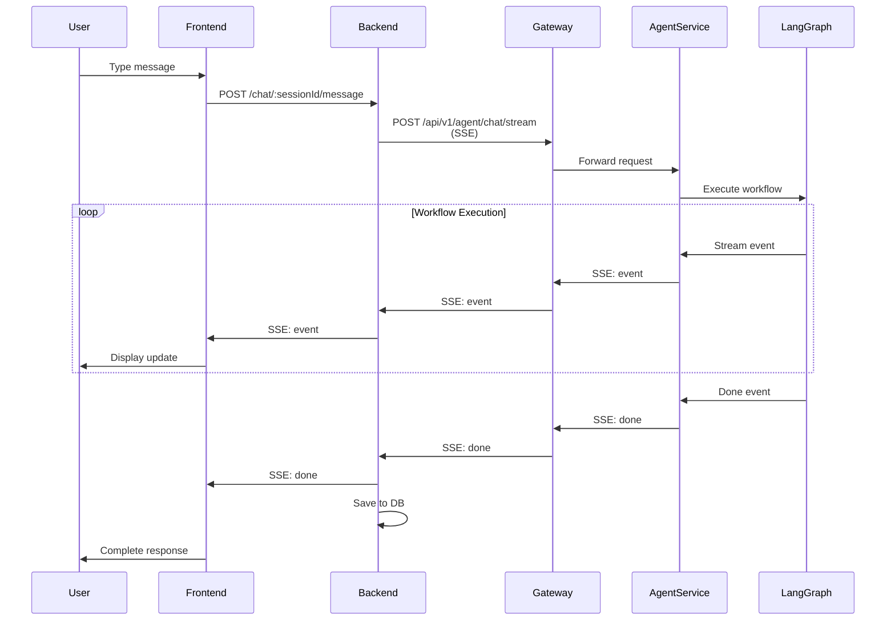
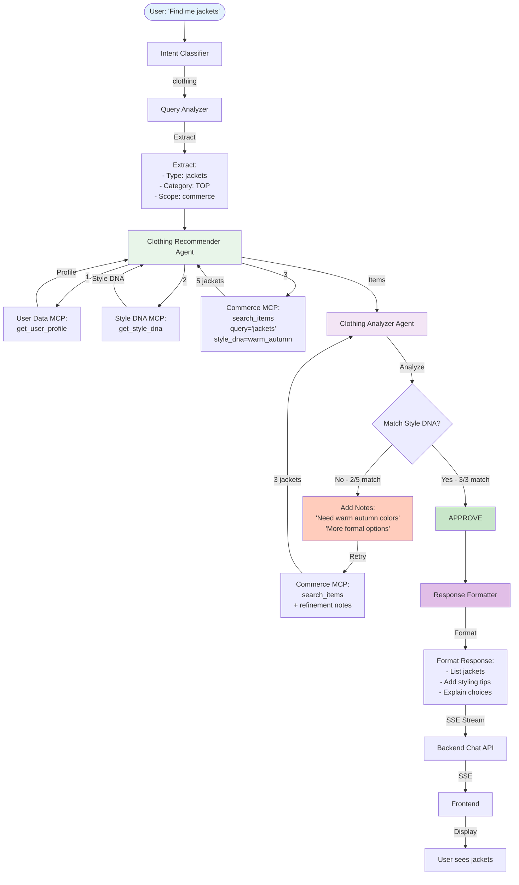
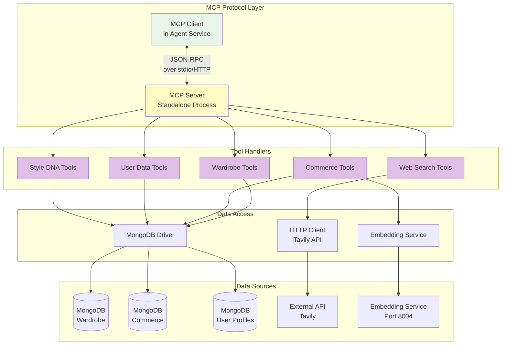

# Multi-Agent System Flow Diagrams

## Complete System Flow

## Clothing Recommendation Workflow (Detailed)

## Agent Communication (A2A Protocol)

## MCP Server Tool Call Flow

## Streaming Architecture

## Example: Complete Flow for "Find me jackets"

## MCP Server Architecture

