# Multi-Agent System Flow Diagrams

## Complete System Flow

## Clothing Recommendation Workflow (Detailed)

## Multi-Turn Clarification Flow

## Agent Communication (LangGraph State Management)

**Note:** The following diagram shows the conceptual flow of agent communication. In the actual implementation, agents communicate through shared LangGraph state rather than explicit A2A protocol messages. State updates trigger workflow transitions automatically.

## Multi-Turn Clarification Resume Flow

```mermaid
sequenceDiagram
    participant User
    participant Gateway
    participant Workflow
    participant CheckNode as Check Clarification
    participant MergeNode as Merge Context
    participant Recommender
    participant Analyzer
    
    Note over User,Analyzer: Turn 2: User responds to clarification
    User->>Gateway: "A formal dinner party"
    Gateway->>Workflow: run_workflow(pending_context)
    
    Workflow->>CheckNode: Entry point
    CheckNode->>CheckNode: Detect pending clarification
    CheckNode->>MergeNode: Route to merge
    
    MergeNode->>MergeNode: Parse response:<br/>"formal dinner party"<br/>→ {occasion: "party"}
    MergeNode->>MergeNode: Merge with saved filters
    MergeNode->>MergeNode: Restore iteration count
    
    MergeNode->>Recommender: Resume with updated filters
    Note over Recommender: Skipped Intent Classifier<br/>and Query Analyzer
    
    Recommender->>Recommender: Search with merged filters
    Recommender->>Analyzer: Updated items
    Analyzer->>Analyzer: Analyze items
    Analyzer->>Workflow: decision = "approve"
    Workflow->>Workflow: Set workflow_status = "completed"
    Workflow->>Gateway: Stream response
    Gateway->>User: "Here are formal party options..."
```

## MCP Server Tool Call Flow

## Streaming Architecture

## Example: Complete Flow for "Find me jackets"

## MCP Server Architecture

