# Multi-Agent System Flow Diagrams

## Complete System Flow


## Clothing Recommendation Workflow (Detailed)


## Multi-Turn Clarification Flow


## Agent Communication (LangGraph State Management)

**Note:** Agents communicate through shared `ConversationState` TypedDict. State updates trigger workflow transitions automatically via conditional routing functions.


## Multi-Turn Clarification Resume Flow

```mermaid
sequenceDiagram
    participant User
    participant Gateway
    participant Workflow
    participant CheckNode as Check Clarification
    participant MergeNode as Merge Context
    participant Recommender
    participant Analyzer
    
    Note over User,Analyzer: Turn 2: User responds to clarification
    User->>Gateway: "A formal dinner party"
    Gateway->>Workflow: run_workflow(pending_context)
    
    Workflow->>CheckNode: Entry point
    CheckNode->>CheckNode: Detect pending clarification
    CheckNode->>MergeNode: Route to merge
    
    MergeNode->>MergeNode: Parse response:<br/>"formal dinner party"<br/>→ {occasion: "party"}
    MergeNode->>MergeNode: Merge with saved filters
    MergeNode->>MergeNode: Restore iteration count
    
    MergeNode->>Recommender: Resume with updated filters
    Note over Recommender: Skipped Intent Classifier<br/>and Query Analyzer
    
    Recommender->>Recommender: Search with merged filters
    Recommender->>Analyzer: Updated items
    Analyzer->>Analyzer: Analyze items
    Analyzer->>Workflow: decision = "approve"
    Workflow->>Workflow: Set workflow_status = "completed"
    Workflow->>Gateway: Stream response
    Gateway->>User: "Here are formal party options..."
```



## MCP Server Tool Call Flow

```mermaid
graph LR
    subgraph agent [LangGraph Agent Node]
        ReactAgent[create_react_agent]
        ToolCall[Tool Call Decision]
    end
    
    subgraph mcp_client [MCP Client]
        MCPAdapter[langchain-mcp-adapters<br/>MultiServerMCPClient]
        BaseTool[LangChain BaseTool]
    end
    
    subgraph mcp_server [MCP Server Port 8010]
        MCPEndpoint[/mcp endpoint<br/>streamable_http]
        FastAPIRoute[FastAPI Route<br/>/tools/*]
        ToolFunc[Tool Function]
    end
    
    subgraph data [Data Layer]
        MongoDB[(MongoDB)]
        External[External API]
    end
    
    ReactAgent -->|1 Decide tool| ToolCall
    ToolCall -->|2 Invoke| BaseTool
    BaseTool -->|3 Call| MCPAdapter
    MCPAdapter -->|4 HTTP POST| MCPEndpoint
    MCPEndpoint -->|5 Route| FastAPIRoute
    FastAPIRoute -->|6 Execute| ToolFunc
    ToolFunc -->|7 Query| MongoDB
    ToolFunc -->|7 Query| External
    MongoDB -->|8 Results| ToolFunc
    External -->|8 Results| ToolFunc
    ToolFunc -->|9 Response| FastAPIRoute
    FastAPIRoute -->|10 JSON| MCPEndpoint
    MCPEndpoint -->|11 MCP Response| MCPAdapter
    MCPAdapter -->|12 Return| BaseTool
    BaseTool -->|13 Tool Result| ReactAgent
```

## Streaming Architecture


## Example: Complete Flow for "Find me jackets"


## MCP Server Architecture

```mermaid
graph TB
    subgraph agent [Conversational Agent]
        MCPClient[MultiServerMCPClient<br/>langchain-mcp-adapters]
        Tools[LangChain BaseTool objects]
        ReactAgent[create_react_agent]
    end
    
    subgraph mcp_server [MCP Servers - Port 8010]
        FastAPI[FastAPI App]
        FastApiMCP[FastApiMCP<br/>fastapi-mcp]
        MCPEndpoint[/mcp endpoint<br/>streamable_http transport]
        
        subgraph routers [FastAPI Routers]
            WR[/api/v1/wardrobe/tools/*]
            CR[/api/v1/commerce/tools/*]
            WSR[/api/v1/web-search/tools/*]
            UDR[/api/v1/user-data/tools/*]
            SDR[/api/v1/style-dna/tools/*]
        end
    end
    
    subgraph shared [Shared Services]
        Mongo[MongoDB Client<br/>shared/mongo.py]
        Embed[Embedding Client<br/>shared/embeddings_client.py]
    end
    
    subgraph data [Data Sources]
        WI[(wardrobeitems)]
        CI[(commerceitems)]
        U[(users)]
        SP[(styleprofiles)]
        CA[(coloranalyses)]
        Tavily[Tavily API]
        EmbedSvc[Embedding Service<br/>Port 8004]
    end
    
    MCPClient -->|get_tools| Tools
    Tools --> ReactAgent
    MCPClient <-->|streamable_http| MCPEndpoint
    
    FastAPI --> FastApiMCP
    FastApiMCP --> MCPEndpoint
    FastAPI --> WR
    FastAPI --> CR
    FastAPI --> WSR
    FastAPI --> UDR
    FastAPI --> SDR
    
    WR --> Mongo
    CR --> Mongo
    CR --> Embed
    UDR --> Mongo
    SDR --> Mongo
    WSR --> Tavily
    
    Mongo --> WI
    Mongo --> CI
    Mongo --> U
    Mongo --> SP
    Mongo --> CA
    Embed --> EmbedSvc
```
