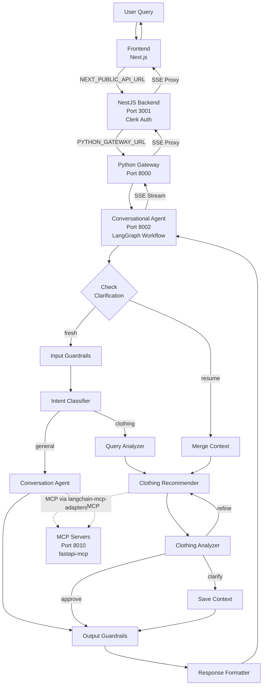
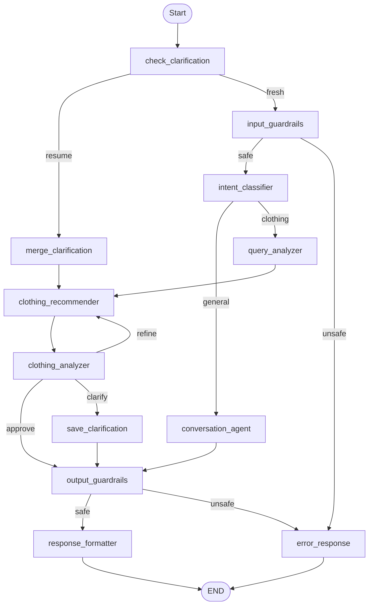

# Multi-Agent Conversational System Implementation Plan

## Architecture Overview

The system uses **LangGraph** for workflow orchestration with shared state (replacing A2A protocol), **MCP (Model Context Protocol) servers** for tool calls, **input/output guardrails** for safety, and **Langfuse** for comprehensive LLM call tracing.

### System Flow



## Core Components

### 1. LangGraph State Management

**File:** `conversational_agent/app/workflows/state.py`

The workflow state replaces A2A protocol for agent communication:

```python
class ConversationState(TypedDict, total=False):
    # Input
    user_id: str
    session_id: str
    message: str
    conversation_history: List[Dict[str, str]]
    
    # Workflow Control (Multi-Turn Support)
    workflow_status: Literal["active", "awaiting_clarification", "completed"]
    is_clarification_response: bool  # True if responding to a clarification
    pending_clarification_context: Optional[Dict[str, Any]]
    # Stores: original_message, clarification_question, extracted_filters,
    #         search_scope, retrieved_items, iteration, style_dna, user_profile
    
    # Intent Classification
    intent: Literal["general", "clothing"]
    
    # Query Analysis (Query Analyzer Node)
    search_scope: Literal["commerce", "wardrobe", "both"]
    extracted_filters: Optional[Dict[str, Any]]  # category, subCategory, brand, etc.
    
    # User Context (fetched via MCP by Recommender Agent)
    user_profile: Optional[UserProfile]
    style_dna: Optional[StyleDNA]
    
    # Clothing Workflow State
    retrieved_items: List[ClothingItem]
    search_sources_used: List[str]  # ["commerce", "wardrobe", "web_search"]
    fallback_used: bool  # True if web search was used
    
    # Analysis Result (Clothing Analyzer Agent)
    analysis_result: Optional[AnalysisResult]
    refinement_notes: Optional[List[str]]  # Only set if analysis_result.decision == "refine"
    needs_clarification: bool  # Only set if analysis_result.decision == "clarify"
    clarification_question: Optional[str]  # Only set if needs_clarification == True
    
    # Output
    final_response: str
    streaming_events: List[StreamEvent]
    
    # Metadata
    metadata: Dict[str, Any]
    langfuse_trace_id: Optional[str]
    iteration: int  # Track refinement iterations (max 3)
```

**Key Design:** All agents read/write to shared state. No explicit A2A messages needed. State transitions handle agent communication.

**Multi-Turn Support:** The `workflow_status`, `is_clarification_response`, and `pending_clarification_context` fields enable proper clarification flows where the workflow pauses, user provides input, and workflow resumes from the saved context.

### MCP Client Configuration

**File:** `conversational_agent/app/mcp/tools.py`

Uses `langchain-mcp-adapters` for MCP integration:

```python
from langchain_mcp_adapters.client import MultiServerMCPClient

config = {
    "aesthetiq": {
        "transport": "streamable_http",
        "url": f"{settings.MCP_SERVERS_URL}/mcp",  # e.g., http://mcp_servers:8010/mcp
    }
}

# Initialize during app startup (lifespan)
_mcp_client = MultiServerMCPClient(config)
_mcp_tools = await _mcp_client.get_tools()  # Returns LangChain BaseTool objects
```

Tools are then used with LangGraph agents via `create_react_agent(model, tools)`.

### 2. Session Management & Chat History

**File:** `conversational_agent/app/services/session/session_service.py`

**Responsibilities:**

- Load chat history from backend before workflow execution
- Persist new messages to backend after workflow completion
- Create new sessions if session_id not provided
- Format conversation history for LLM context
- Manage session lifecycle

**Implementation:**

```python
class SessionService:
    def __init__(self, backend_client: BackendClient):
        self.backend_client = backend_client
    
    async def load_session(self, user_id: str, session_id: Optional[str]) -> SessionData:
        """
        Load session and history from backend.
        If session_id not provided, create new session.
        
        Returns:
            SessionData with session_id, messages, metadata
        """
        if not session_id:
            # Create new session
            session = await self.backend_client.create_session(
                user_id=user_id,
                title="New Conversation"
            )
            return SessionData(
                session_id=session["sessionId"],
                messages=[],
                metadata={}
            )
        else:
            # Load existing session
            session = await self.backend_client.get_session(session_id)
            return SessionData(
                session_id=session["sessionId"],
                messages=session["messages"],
                metadata=session.get("metadata", {})
            )
    
    async def save_message(self, session_id: str, role: str, 
                          content: str, metadata: Dict = None):
        """
        Save message to backend session.
        """
        await self.backend_client.add_message(
            session_id=session_id,
            role=role,
            content=content,
            metadata=metadata or {}
        )
    
    def format_history_for_llm(self, messages: List[Dict], max_messages: int = 10) -> List[Dict]:
        """
        Format conversation history for LLM context.
        Limits to last N messages to avoid token limits.
        """
        recent_messages = messages[-max_messages:] if len(messages) > max_messages else messages
        return [
            {"role": msg["role"], "content": msg["content"]}
            for msg in recent_messages
        ]
```

**Integration Points:**

- Before workflow: Load session and history
- During workflow: Use history in state for LLM context
- After workflow: Save user message and assistant response to backend

**File:** `conversational_agent/app/services/backend_client.py`

**Responsibilities:**

- HTTP client for backend chat API
- Methods: create_session, get_session, add_message, update_session

**Implementation:**

```python
class BackendClient:
    def __init__(self, base_url: str):
        self.base_url = base_url
        self.client = httpx.AsyncClient(base_url=base_url)
    
    async def create_session(self, user_id: str, title: str) -> Dict:
        """Create new chat session in backend"""
        response = await self.client.post(
            "/chat",
            json={"userId": user_id, "title": title}
        )
        return response.json()
    
    async def get_session(self, session_id: str) -> Dict:
        """Get session by sessionId"""
        response = await self.client.get(f"/chat/session/{session_id}")
        return response.json()
    
    async def add_message(self, session_id: str, role: str, 
                         content: str, metadata: Dict = None):
        """Add message to session"""
        await self.client.post(
            f"/chat/{session_id}/message",
            json={
                "role": role,
                "content": content,
                "metadata": metadata or {}
            }
        )
```

**Workflow Integration:**

**File:** `conversational_agent/app/api/v1/endpoints/chat.py`

```python
@router.post("/chat/stream")
async def chat_stream(request: ConversationRequest):
    # 1. Load session and history
    session_data = await session_service.load_session(
        user_id=request.user_id,
        session_id=request.session_id
    )
    
    # 2. Format history for LLM
    conversation_history = session_service.format_history_for_llm(
        session_data.messages
    )
    
    # 3. Create initial state with history
    initial_state = ConversationState(
        user_id=request.user_id,
        session_id=session_data.session_id,
        message=request.message,
        conversation_history=conversation_history,
        # ... other fields
    )
    
    # 4. Execute workflow
    async for event in workflow.astream(initial_state):
        # Stream events to backend
        yield event
    
    # 5. Save messages to backend
    final_state = await workflow.ainvoke(initial_state)
    await session_service.save_message(
        session_id=session_data.session_id,
        role="user",
        content=request.message
    )
    await session_service.save_message(
        session_id=session_data.session_id,
        role="assistant",
        content=final_state["final_response"],
        metadata=final_state.get("metadata", {})
    )
```

**Testing:**

- Unit test: Mock backend client, verify session loading/saving
- Integration test: Real backend API, verify persistence
- History test: Verify history formatting and limits

### 3. Input Guardrails

**File:** `conversational_agent/app/guardrails/input_guardrails.py`

**Responsibilities:**

- Content moderation (inappropriate content detection)
- PII detection and redaction
- Input length validation
- Special character sanitization
- Prompt injection pattern detection

**Implementation:**

```python
class InputGuardrails:
    def validate(self, user_input: str) -> GuardrailResult:
        # Check for inappropriate content
        # Detect PII
        # Validate length
        # Sanitize special characters
        # Return: (is_safe: bool, sanitized_input: str, warnings: List[str])
```

**Integration Points:**

- Gateway level (before routing)
- Agent service level (before LangGraph workflow)

### 3. Output Guardrails

**File:** `conversational_agent/app/guardrails/output_guardrails.py`

**Responsibilities:**

- Content moderation of LLM responses
- Ensure responses are on-topic (fashion-related)
- Filter inappropriate content
- Validate response format
- Check for hallucinated information

**Implementation:**

```python
class OutputGuardrails:
    def validate(self, llm_response: str, context: Dict) -> GuardrailResult:
        # Check for inappropriate content
        # Verify on-topic (fashion-related)
        # Validate format
        # Return: (is_safe: bool, filtered_response: str, warnings: List[str])
```

**Integration Points:**

- After each LLM call in agents
- Before streaming to backend
- In response formatter

### 5. Langfuse Tracing

**File:** `conversational_agent/app/services/tracing/langfuse_service.py`

**Responsibilities:**

- Trace all LLM calls with full context
- Track tool calls (MCP server calls)
- Log agent transitions
- Capture state changes
- Monitor performance metrics

**Implementation:**

```python
class LangfuseTracingService:
    def start_trace(self, user_id: str, session_id: str) -> str:
        # Create parent trace
        # Return trace_id
    
    def log_llm_call(self, trace_id: str, agent_name: str, 
                     input: str, output: str, metadata: Dict):
        # Log LLM call as span
    
    def log_tool_call(self, trace_id: str, tool_name: str,
                      input: Dict, output: Dict, duration: float):
        # Log MCP tool call as span
    
    def log_agent_transition(self, trace_id: str, from_agent: str,
                             to_agent: str, state_snapshot: Dict):
        # Log agent transitions
```

**Integration Points:**

- Start trace at workflow entry
- Log each LLM call in agents
- Log each MCP tool call
- Log state transitions
- End trace at workflow completion

## Agent Definitions

### Node 1: Query Analyzer Node

**File:** `conversational_agent/app/workflows/nodes/query_analyzer_node.py`

**Purpose:** Analyze user query and determine search scope

**Responsibilities:**

- Extract clothing types, filters (category, subCategory, brand)
- Determine search scope: commerce, wardrobe, or both
- Identify if user wants to "buy new", "use existing", or "combine"

**State Reads:**

- `message`, `conversation_history`

**State Writes:**

- `search_scope` ("commerce", "wardrobe", or "both")
- `extracted_filters` (category, subCategory, brand, colorHex)
- `metadata.query_analysis`

**Logic:**

- Uses LLM to analyze query intent
- Determines scope based on keywords like "buy", "new", "my clothes", "combine", "existing"
- Extracts structured filters for database queries

**Testing:**

- Unit test: Mock LLM, verify scope determination
- Integration test: Real LLM, verify accurate scope detection

### Agent 1: Conversation Agent (General Fashion Chat)

**File:** `conversational_agent/app/agents/conversation_agent.py`

**Purpose:** Handle general fashion questions, trends, advice

**Capabilities:**

- Fashion advice and tips
- Latest trends discussion
- Fashion expert blogs/articles
- Color theory explanations
- Style guidance

**Tools Available:**

- `web_search` (Web Search MCP) - Search for trends/blogs
- `get_style_dna` (Style DNA MCP) - Get user's style DNA

**State Reads:**

- `message`, `conversation_history`, `style_dna`

**State Writes:**

- `final_response`, `metadata.agent_used`

**History Usage:**

- Uses `conversation_history` to provide context-aware responses
- Formats history as LLM messages: `[SystemMessage, ...history, HumanMessage(current)]`
- Limits history to last 10 messages to avoid token limits

**Guardrails:**

- Input: Validate user query
- Output: Ensure response is fashion-related, appropriate

**Langfuse:**

- Trace: `conversation_agent_call`
- Log: Input message, tool calls, LLM response

**Testing:**

- Unit test: Mock LLM, verify fashion-related responses
- Integration test: End-to-end with real MCP servers
- Guardrail test: Test with inappropriate inputs
- History test: Verify context-aware responses with conversation history

### Agent 2: Clothing Recommender Agent

**File:** `conversational_agent/app/agents/clothing_recommender_agent.py`

**Purpose:** Intelligently retrieve clothing items

**Workflow:**

1. Read state: `message`, `search_scope`, `refinement_notes`, `user_id`
2. **Fetch Context First** (if not already in state):

   - User Data MCP: `get_user_profile(user_id)` → Write to `user_profile`
   - Style DNA MCP: `get_style_dna(user_id)` → Write to `style_dna`

3. **Search Based on Scope**:

   - If `search_scope == "commerce"`: Commerce MCP: `search_commerce_items(query, style_dna, refinement_notes)`
   - If `search_scope == "wardrobe"`: Wardrobe MCP: `search_wardrobe_items(query, refinement_notes)`
   - If `search_scope == "both"`: Both in parallel

4. **Check Results**:

   - If no results from commerce/wardrobe → Fallback to Web Search MCP: `web_search(query)`

5. Combine results (prioritize commerce/wardrobe over web search)
6. Write state: `retrieved_items`, `metadata.search_sources_used`

**State Reads:**

- `message`, `user_id`, `search_scope`, `refinement_notes`
- `user_profile` (if already fetched, skip MCP call)
- `style_dna` (if already fetched, skip MCP call)

**State Writes:**

- `retrieved_items` (list of clothing items with metadata)
- `user_profile` (if fetched)
- `style_dna` (if fetched)
- `metadata.search_performed` (which sources were searched)
- `metadata.fallback_used` (if web search was used)

**Guardrails:**

- Input: Validate query, search scope
- Output: Validate retrieved items format, filter inappropriate items

**Langfuse:**

- Trace: `clothing_recommender_call`
- Log: Query, MCP tool calls, retrieved items count

**Testing:**

- Unit test: Mock MCP clients, verify search logic
- Integration test: Real MCP servers, verify item retrieval
- Edge cases: No results, partial results, MCP server failures

### Agent 3: Clothing Analyzer Agent

**File:** `conversational_agent/app/agents/clothing_analyzer_agent.py`

**Purpose:** Validate and refine retrieved clothing items

**Decision Logic:**

1. Analyze: `retrieved_items` + `message` + `style_dna` + `user_profile`
2. Decision:

   - **APPROVE**: Items match → Write `analysis_result.approved = True`, `analysis_result.decision = "approve"`
   - **REFINE**: Items don't match → Write `refinement_notes` (list of improvement suggestions), `analysis_result.decision = "refine"` → Loop back to **Recommender Agent** (not Query Analyzer)
   - **CLARIFY**: Query unclear → Write `needs_clarification = True`, `clarification_question`, `analysis_result.decision = "clarify"` → Loop back to **Query Analyzer Node** (for new query analysis)

**State Reads:**

- `retrieved_items`, `message`, `style_dna`, `user_profile`, `search_scope`

**State Writes:**

- `analysis_result` (with decision, approved flag, notes)
- `refinement_notes` (only if decision is "refine")
- `needs_clarification` (only if decision is "clarify")
- `clarification_question` (only if decision is "clarify")

**Refinement Notes Format:**

- List of specific improvement suggestions
- Example: ["Need more formal options", "Require colors matching warm autumn palette", "Missing size L in jackets"]

**Guardrails:**

- Input: Validate retrieved items structure
- Output: Ensure analysis is constructive, on-topic

**Langfuse:**

- Trace: `clothing_analyzer_call`
- Log: Items analyzed, decision made, refinement notes (if any)

**Testing:**

- Unit test: Mock items, verify decision logic
- Integration test: Real items, verify analysis quality
- Decision test: Test approve/refine/clarify paths

## MCP Servers

**Implementation:** Uses `fastapi-mcp` to expose FastAPI routes as MCP tools at `/mcp` endpoint.

**Main File:** `mcp_servers/main.py`

```python
from fastapi_mcp import FastApiMCP

mcp = FastApiMCP(app, name="Aesthetiq MCP Server", ...)
mcp.mount_http()  # Mounts streamable HTTP transport at /mcp
```

### MCP Server 1: Wardrobe Server

**Router:** `mcp_servers/wardrobe_server/router.py`
**Prefix:** `/api/v1/wardrobe`

**Tools:**

- `POST /tools/search_wardrobe_items` - Semantic search with CLIP embeddings
  - Input: `{query, user_id, filters?: WardrobeFilters, limit?}`
  - Output: `List[{item: WardrobeItem, score: float}]`
- `POST /tools/get_wardrobe_item` - Get item by ID
  - Input: `{item_id, user_id}`
- `POST /tools/filter_wardrobe_items` - Filter by metadata
  - Input: `{user_id, filters?: WardrobeFilters, limit?}`

**Data Source:** MongoDB `wardrobeitems` collection

### MCP Server 2: Commerce Server

**Router:** `mcp_servers/commerce_server/router.py`
**Prefix:** `/api/v1/commerce`

**Tools:**

- `POST /tools/search_commerce_items` - Semantic search + style DNA ranking
  - Input: `{query, style_dna?: string, filters?: CommerceFilters, limit?, candidate_pool?}`
  - Output: `List[{item: CommerceItem, score: float, breakdown: dict}]`
  - Uses `seasonalPaletteScores` for accurate color season matching
- `POST /tools/get_commerce_item` - Get item by ID
- `POST /tools/filter_commerce_items` - Filter by metadata

**Data Source:** MongoDB `commerceitems` collection

**Ranking:** `combine_scores(semantic_score, season_score)` from `style_ranking.py`

### MCP Server 3: Web Search Server

**Router:** `mcp_servers/web_search_server/router.py`
**Prefix:** `/api/v1/web-search`

**Tools:**

- `POST /tools/web_search` - General web search
  - Input: `{query, max_results?}`
  - Uses: Tavily API via `tavily_client.py`
- `POST /tools/search_trends` - Fashion trends
  - Searches: `"fashion trends {topic} 2026"`
- `POST /tools/search_blogs` - Fashion blogs
  - Searches: `"{query} site:fashion blog OR site:blog"`

**External API:** Tavily Search API (`TAVILY_API_KEY`)

### MCP Server 4: User Data Server

**Router:** `mcp_servers/user_data_server/router.py`
**Prefix:** `/api/v1/user-data`

**Tools:**

- `POST /tools/get_user_profile` - Get user by clerkId
  - Input: `{user_id}`
  - Output: `UserProfile{user_id, email, name, subscription_status, role, settings}`

**Data Source:** MongoDB `users` collection

### MCP Server 5: Style DNA Server

**Router:** `mcp_servers/style_dna_server/router.py`
**Prefix:** `/api/v1/style-dna`

**Tools:**

- `POST /tools/get_style_dna` - Complete style DNA
  - Input: `{user_id}`
  - Output: Combined data from `styleprofiles` + `coloranalyses`
  - Includes: color_season, contrast_level, undertone, palette, archetype, sizes, budget_range
- `POST /tools/get_color_season` - Just color season
- `POST /tools/get_style_archetype` - Style archetype
- `POST /tools/get_recommended_colors` - Color palette for season
- Additional: `get_contrast_level`, `get_undertone`, `get_style_sliders`, `get_user_palette`

**Data Sources:** MongoDB `styleprofiles` and `coloranalyses` collections

## LangGraph Workflow

**File:** `conversational_agent/app/workflows/main_workflow.py`

**Actual Workflow Nodes:**

| Node Name | Display Name | Function |
|-----------|--------------|----------|
| `check_clarification` | "Checking conversation context" | Entry point - determines if resuming |
| `merge_clarification` | "Processing your clarification" | Merges clarification into filters |
| `input_guardrails` | "Validating input" | GuardrailsAI check |
| `intent_classifier` | "Understanding your request" | LLM-based intent classification |
| `query_analyzer` | "Analyzing what you're looking for" | Extracts filters and search scope |
| `conversation_agent` | "Preparing response" | General fashion questions |
| `clothing_recommender` | "Searching for items" | MCP tool calls to retrieve items |
| `clothing_analyzer` | "Evaluating recommendations" | Decides approve/refine/clarify |
| `save_clarification` | "Preparing follow-up question" | Saves context for resumption |
| `output_guardrails` | "Validating response" | Output validation (passthrough) |
| `response_formatter` | "Formatting your response" | Formats final response |
| `error_response` | "Handling error" | Error handling |

**Workflow Structure:**



**Routing Functions:**
- `route_after_clarification_check`: Returns "resume" or "fresh"
- `route_after_input_guardrails`: Returns "safe" or "unsafe"
- `route_after_intent`: Returns "general" or "clothing"
- `route_after_analysis`: Returns "approve", "refine", "clarify", or "error"
- `route_after_output_guardrails`: Returns "safe" or "unsafe"

**Node Implementation:**

- Each node reads/writes to shared `ConversationState`
- Langfuse tracing at each node
- Guardrails at entry/exit points

**Key Workflow Details:**

1. **Query Analyzer Node** - Determines search scope (commerce/wardrobe/both) and writes to state
2. **Scope Decision** - Conditional routing based on `search_scope` in state
3. **Clothing Recommender Agent** - Fetches context (User Data MCP, Style DNA MCP) BEFORE searching, then searches based on scope
4. **Results Check** - If no results from commerce/wardrobe, fallback to Web Search MCP
5. **Clothing Analyzer Agent** - Analyzes and can approve/refine/clarify
6. **Refinement Loop** - Goes back to Recommender Agent (not Query Analyzer)
7. **Clarification Loop** - Goes back to Query Analyzer Node (for new query analysis)

## Testing Strategy

### Unit Tests

**File:** `conversational_agent/tests/unit/`

**Coverage:**

- Each agent (mock LLM, mock MCP clients)
- Guardrails (input/output validation)
- State management (state transitions)
- Langfuse service (trace creation)

**Example:**

```python
def test_conversation_agent_fashion_response():
    agent = ConversationAgent(mock_llm, mock_mcp_client)
    state = {"message": "What are fashion trends?"}
    result = agent.process(state)
    assert "fashion" in result["final_response"].lower()
```

### Integration Tests

**File:** `conversational_agent/tests/integration/`

**Coverage:**

- End-to-end workflow execution
- Real MCP server calls
- Real LLM calls (with test API keys)
- Guardrail integration

**Example:**

```python
def test_clothing_recommendation_workflow():
    workflow = create_workflow()
    state = create_initial_state("Find me jackets")
    result = await workflow.ainvoke(state)
    assert len(result["retrieved_items"]) > 0
    assert result["analysis_result"]["approved"] == True
```

### Guardrail Tests

**File:** `conversational_agent/tests/guardrails/`

**Coverage:**

- Inappropriate content detection
- PII detection
- Output filtering
- On-topic validation

**Example:**

```python
def test_input_guardrail_inappropriate_content():
    guardrail = InputGuardrails()
    result = guardrail.validate("inappropriate query")
    assert result.is_safe == False
    assert len(result.warnings) > 0
```

### MCP Server Tests

**File:** `mcp_servers/*/tests/`

**Coverage:**

- Tool call handling
- Data retrieval
- Error handling
- Performance

### Session & History Tests

**File:** `conversational_agent/tests/session/`

**Coverage:**

- Session creation when session_id not provided
- Session loading with existing history
- History formatting for LLM context
- Message persistence to backend
- History limit enforcement (max messages)
- Multi-turn conversation context

**Example:**

```python
def test_session_creation():
    session_service = SessionService(mock_backend_client)
    session = await session_service.load_session("user_123", None)
    assert session.session_id is not None
    assert len(session.messages) == 0

def test_history_loading():
    session_service = SessionService(mock_backend_client)
    session = await session_service.load_session("user_123", "existing_session")
    assert len(session.messages) > 0
    assert session.messages[0]["role"] == "user"

def test_history_formatting():
    session_service = SessionService(mock_backend_client)
    messages = [{"role": "user", "content": f"Message {i}"} for i in range(15)]
    formatted = session_service.format_history_for_llm(messages, max_messages=10)
    assert len(formatted) == 10
    assert formatted[0]["content"] == "Message 5"  # Last 10 messages
```

## Final Pipeline

### Request Flow

1. **User sends message** → Frontend (Next.js)
2. **Frontend** → NestJS Backend (POST /api/agent/chat/stream)
   - `useChatApi` hook sends request with Clerk JWT
   - Backend validates Clerk token
   - Backend extracts `user_id` from authenticated token
3. **NestJS Backend** → Python Gateway (POST /api/v1/agent/chat/stream)
   - AgentService proxies SSE stream
   - Sets proper headers: `Content-Type: text/event-stream`
4. **Python Gateway** → Conversational Agent Service (POST /api/v1/agent/chat/stream)
   - Proxies with 600s timeout for agentic workflows
5. **Agent Service** → Session Service:
   - Load session from backend (via BackendClient)
   - Load conversation history
   - Format history for LLM context (limit 10 messages)
6. **Agent Service** → LangGraph Workflow (`run_workflow_streaming`):
   - Create initial state with history
   - Execute nodes: check_clarification → input_guardrails → intent_classifier → ...
   - Stream events via `astream_events(state, version="v2")`
   - MCP tool calls via `langchain-mcp-adapters`
7. **Agent Service** → Session Service:
   - Save user message to backend
   - Save assistant response to backend
8. **SSE Stream Chain:**
   - Agent → Gateway → Backend → Frontend
   - Events: metadata, status, node_start, node_end, intent, filters, items_found, analysis, chunk, done
9. **Frontend** → User (displays response)
   - `useChatApi` hook processes events
   - Updates UI in real-time

### Streaming Events

**Event Types (from `state.py` StreamEvent class):**

| Event | Content | Description |
|-------|---------|-------------|
| `metadata` | `{session_id, user_id, trace_id}` | Initial connection info |
| `status` | `{message}` | Human-readable progress |
| `node_start` | `{node, display_name}` | Workflow node started |
| `node_end` | `{node}` | Workflow node finished |
| `intent` | `{intent}` | "general" or "clothing" |
| `filters` | `{filters, scope}` | Extracted search filters |
| `items_found` | `{count, sources[]}` | Items retrieved |
| `analysis` | `{decision, confidence}` | Analyzer decision |
| `tool_call` | `{tool, input}` | MCP tool invocation |
| `chunk` | `{content}` | Response text chunk |
| `done` | `{response, intent, items[], workflow_status, needs_clarification, clarification_question, session_id}` | Final complete response |
| `error` | `{message}` | Error message |

## Potential Use Cases

### Use Case 1: General Fashion Question

**Query:** "What are the latest fashion trends?"

**Flow:** Intent → General → Conversation Agent → Web Search MCP → Response

### Use Case 2: Simple Clothing Recommendation

**Query:** "I need a jacket for a job interview"

**Flow:** Intent → Clothing → Query Analyzer → Recommender → Analyzer → Response

### Use Case 3: Wardrobe + Commerce Combination

**Query:** "I want to combine my blue shirt with something new"

**Flow:** Intent → Clothing → Query Analyzer (both) → Recommender (wardrobe + commerce) → Analyzer → Response

### Use Case 4: Refinement Loop

**Query:** "Find me jackets"

**Flow:** Query Analyzer → Recommender → Analyzer (refine) → Recommender (retry with notes) → Analyzer (approve) → Response

### Use Case 5: Web Search Fallback

**Query:** "Find me a specific brand jacket"

**Flow:** Recommender (commerce: no results) → Recommender (wardrobe: no results) → Web Search MCP → Analyzer → Response

### Use Case 6: Clarification Needed (Multi-Turn)

**Turn 1 Query:** "Find me something nice"

**Turn 1 Flow:** 
1. Check Clarification (fresh) → Input Guardrails → Intent Classifier → Query Analyzer 
2. Recommender (vague search) → Analyzer (clarify decision)
3. Save Clarification Context → Response Formatter
4. END with `workflow_status = "awaiting_clarification"`
5. User receives: "What occasion is this for?"

**Turn 2 Query:** "A formal dinner party"

**Turn 2 Flow:**
1. Check Clarification (resume - has pending context)
2. Merge Clarification Context (extracts: occasion=party, style=formal)
3. Recommender (searches with updated filters) → Analyzer (approve)
4. Response Formatter → END with `workflow_status = "completed"`

## Potential Workflows

### Workflow 1: General Conversation

```
Intent Classifier → Conversation Agent → Response Formatter
```

### Workflow 2: Clothing Recommendation (Simple)

```
Intent Classifier → Query Analyzer → Scope Decision → Recommender (fetch context + search) → Results Check → Analyzer → Response Formatter
```

### Workflow 3: Clothing Recommendation (With Refinement)

```
Intent Classifier → Query Analyzer → Scope Decision → Recommender → Results Check → Analyzer → [Refine] → Recommender (retry with notes) → Analyzer → Response Formatter
```

### Workflow 4: Clothing Recommendation (With Clarification - Multi-Turn)

```
Turn 1:
Check Clarification (fresh) → Intent Classifier → Query Analyzer → Recommender → Analyzer → [Clarify] → Save Context → Response Formatter → END (awaiting)

Turn 2:
Check Clarification (resume) → Merge Context → Recommender → Analyzer → [Approve] → Response Formatter → END (completed)
```

### Workflow 5: Clothing Recommendation (With Web Search Fallback)

```
Intent Classifier → Query Analyzer → Scope Decision → Recommender → Results Check → [No Results] → Web Search MCP → Analyzer → Response Formatter
```

## File Structure

```
aesthetiq/
├── backend/src/agent/              # NestJS Agent Module (NEW)
│   ├── agent.module.ts
│   ├── agent.controller.ts         # POST /api/agent/chat, /chat/stream
│   ├── agent.service.ts            # SSE proxy to Python Gateway
│   └── dto/chat-request.dto.ts
│
├── frontend/
│   ├── lib/chat-api.ts             # useChatApi hook + SSE client
│   └── types/chat.ts               # StreamEvent TypeScript interfaces
│
└── python_engine/
    ├── conversational_agent/       # Port 8002
    │   ├── app/
    │   │   ├── main.py             # FastAPI + lifespan (MCP init)
    │   │   ├── agents/
    │   │   │   ├── conversation_agent.py
    │   │   │   ├── clothing_recommender_agent.py
    │   │   │   └── clothing_analyzer_agent.py
    │   │   ├── workflows/
    │   │   │   ├── main_workflow.py  # LangGraph + run_workflow_streaming
    │   │   │   ├── state.py          # ConversationState, StreamEvent
    │   │   │   └── nodes/
    │   │   │       ├── intent_classifier.py
    │   │   │       ├── query_analyzer.py
    │   │   │       └── response_formatter.py
    │   │   ├── guardrails/
    │   │   │   ├── base.py
    │   │   │   ├── safety_guardrails.py
    │   │   │   └── providers/guardrails_ai_provider.py
    │   │   ├── services/
    │   │   │   ├── llm_service.py
    │   │   │   ├── backend_client.py
    │   │   │   ├── session/session_service.py
    │   │   │   └── tracing/langfuse_service.py
    │   │   ├── mcp/tools.py          # langchain-mcp-adapters
    │   │   └── api/v1/endpoints/chat.py
    │   └── tests/
    │
    ├── mcp_servers/                  # Port 8010
    │   ├── main.py                   # FastAPI + fastapi-mcp
    │   ├── shared/
    │   │   ├── mongo.py
    │   │   └── embeddings_client.py
    │   ├── wardrobe_server/
    │   │   ├── router.py, tools.py, schemas.py, db.py
    │   ├── commerce_server/
    │   │   ├── router.py, tools.py, schemas.py, db.py, style_ranking.py
    │   ├── web_search_server/
    │   │   ├── router.py, tools.py, schemas.py, tavily_client.py
    │   ├── user_data_server/
    │   │   ├── router.py, tools.py, schemas.py, db.py
    │   └── style_dna_server/
    │       ├── router.py, tools.py, schemas.py, db.py, color_mappings.py
    │
    └── gateway/                      # Port 8000
        └── app/
            ├── config.py
            ├── proxy.py
            └── routes/agent.py
```

## Implementation Issues

All implementation work is organized into 6 issues located in `python_engine/docs/issues/`:

1. **[Issue 1: Core Infrastructure](docs/issues/01-core-infrastructure.md)** - Foundation setup (state, MCP client, Langfuse, session management)
2. **[Issue 2: MCP Servers](docs/issues/02-mcp-servers.md)** - All 5 MCP servers with test endpoints
3. **[Issue 3: Agents and Workflow](docs/issues/03-agents-workflow.md)** - All agents and complete LangGraph workflow with Langfuse traces
4. **[Issue 4: Safety Guardrails](docs/issues/04-safety-guardrails.md)** - Input/output guardrails
5. **[Issue 5: Integration and E2E](docs/issues/05-integration-e2e.md)** - Backend integration and end-to-end testing
6. **[Issue 6: Performance Optimization](docs/issues/06-performance-optimization.md)** - Performance optimization and bug fixes

Each issue can be copied and pasted into your issue tracker (GitHub, Jira, etc.) and assigned to team members.

## Implementation Phases (Iterative with PRs)

### Development Workflow

Each phase follows this pattern:

1. **Read Issue** - Review issue in `python_engine/docs/issues/`
2. **Create Branch** - `git checkout -b feature/issue-name`
3. **Implement** - Complete all tasks in the issue
4. **Test** - Write and run tests (unit + integration)
5. **Document** - Update documentation if needed
6. **PR** - Create Pull Request with:

   - Code changes
   - Test results
   - Documentation updates
   - Screenshots/logs if applicable

7. **Review & Merge** - After approval, merge to main
8. **Next Issue** - Only proceed after previous issue is merged

### Issue Structure

All issues are defined in `python_engine/docs/issues/`:

- **Issue 1:** Core Infrastructure Implementation
- **Issue 2:** MCP Servers Implementation and Test Endpoints
- **Issue 3:** Create and Define Agents, Test Workflow (with Langfuse)
- **Issue 4:** Add Safety Guardrails
- **Issue 5:** Integration and End-to-End Testing
- **Issue 6:** Performance Optimization and Bug Fixes

Each issue includes:

- Overview and context
- Detailed tasks
- Testing requirements
- Files to create/modify
- PR creation guidelines
- Dependencies and blockers

### Phase 1: Core Infrastructure (Issue 1)

**Goal:** Set up foundation for all other components

**Tasks:**

- LangGraph State Management
- MCP Client Library
- Langfuse Tracing Service
- Session Management & Backend Client
- Basic Workflow Structure

**Deliverable:** PR with all core infrastructure components tested

### Phase 2: MCP Servers (Issue 2)

**Goal:** Build and test all MCP servers independently

**Tasks:**

- Wardrobe MCP Server (with test endpoints)
- Commerce MCP Server (with test endpoints)
- Web Search MCP Server (with test endpoints)
- User Data MCP Server (with test endpoints)
- Style DNA MCP Server (with test endpoints)

**Deliverable:** PR with all 5 MCP servers implemented and tested

### Phase 3: Agents and Workflow (Issue 3)

**Goal:** Build all agents and complete workflow

**Tasks:**

- Query Analyzer Node
- Conversation Agent
- Clothing Recommender Agent
- Clothing Analyzer Agent
- Response Formatter Node
- Complete Workflow Assembly
- Test Workflow with Langfuse

**Deliverable:** PR with complete workflow, all agents tested, Langfuse traces shared

### Phase 4: Safety Guardrails (Issue 4)

**Goal:** Add input and output safety guardrails

**Tasks:**

- Input Guardrails (content moderation, PII detection, etc.)
- Output Guardrails (content moderation, on-topic validation)
- Guardrail Base Classes
- Integrate Guardrails into Workflow
- Test Guardrails

**Deliverable:** PR with guardrails implemented and integrated

### Phase 5: Integration and E2E Testing (Issue 5)

**Goal:** Integrate with backend and test end-to-end

**Tasks:**

- API Endpoint Implementation
- Backend Chat API Integration
- Gateway Route Updates
- Docker Compose Updates
- End-to-End Testing
- Error Handling

**Deliverable:** PR with complete integration, E2E tests passing

### Phase 6: Performance Optimization (Issue 6)

**Goal:** Optimize performance and fix bugs

**Tasks:**

- Performance Analysis
- Caching Implementation
- Parallel Processing Optimization
- Database Optimization
- LLM Optimization
- Bug Fixes
- Monitoring and Metrics
- Load Testing

**Deliverable:** PR with performance improvements, bug fixes, load test results

## Key Files to Create/Modify

1. **New Service:** `conversational_agent/app/main.py` - FastAPI app entry point
2. **State:** `conversational_agent/app/workflows/state.py` - LangGraph state definition
3. **Workflow:** `conversational_agent/app/workflows/main_workflow.py` - Main LangGraph workflow
4. **Query Analyzer Node:** `conversational_agent/app/workflows/nodes/query_analyzer_node.py` - Analyzes query and determines scope
5. **Session Management:** `conversational_agent/app/services/session/session_service.py` - Session and history management
6. **Backend Client:** `conversational_agent/app/services/backend_client.py` - HTTP client for backend chat API
7. **Guardrails:** `conversational_agent/app/guardrails/input_guardrails.py` and `output_guardrails.py`
8. **Tracing:** `conversational_agent/app/services/tracing/langfuse_service.py`
9. **Agents:** Three agent files in `conversational_agent/app/agents/`
10. **MCP Servers:** Five MCP server implementations
11. **Gateway Route:** Update `gateway/app/routes/agent.py` to route to new service
12. **Docker Compose:** Update to include new service and MCP servers

## Success Criteria

- All agents process queries correctly
- Guardrails block inappropriate content
- Langfuse traces all LLM calls
- MCP servers respond correctly
- End-to-end streaming works
- Refinement loops function properly
- Performance meets requirements (<5s for simple queries)
- Chat history loads correctly from backend
- Messages persist to backend after workflow completion
- Sessions are created/retrieved correctly
- Multi-turn conversations maintain context